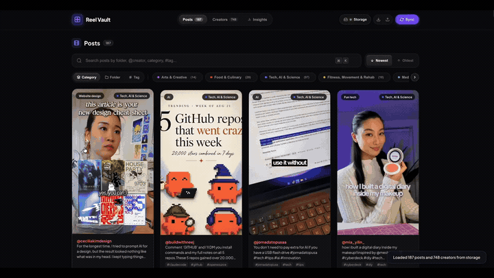

# Reel Vault

> **A fast, private, and searchable personal library for your saved Instagram reels.**

  

---

## Table of Contents

- [Why Reel Vault?](#why-reel-vault)
- [What You Can Do With It](#what-you-can-do-with-it)
- [How to Install](#how-to-install-takes-1-minute)
- [How to Use Reel Vault](#how-to-use-reel-vault)
  - [Step 1: Sync Your Saved Reels](#step-1-sync-your-saved-reels)
  - [Step 2: Connect a Storage Folder](#step-2-connect-a-storage-folder-auto-save-to-disk)
  - [Step 3: Browse & Search](#step-3-browse--search)
- [Frequently Asked Questions](#frequently-asked-questions)
- [License](#license)

---

## Why Reel Vault?

We all save tons of reels on Instagram: quick recipes, fitness workouts, design ideas, travel spots, business tips, and tutorials. 

The problem is Instagram's saved section quickly turns into a black hole:
- You cannot search by keywords inside captions or hashtags.
- You cannot easily find that one reel you saved months ago.
- Everything gets mixed up, and finding specific creators or topics is frustrating.

**Reel Vault fixes that.** It pulls your saved Instagram posts into your own organized, searchable dashboard on your computer so you can actually find and review the content you care about.

---

## What You Can Do With It

- **Instant Keyword Search:** Search through captions, creator handles, hashtags, and folder names simultaneously.
- **Smart Categories:** Automatically sorts your saves into clear topics like Food & Cooking, Fitness & Health, Tech, Business, Art & Design, Travel, and more.
- **Creator Directory:** See all the creators you saved reels from. Filter between creators you already follow and new ones you discovered.
- **Folder Explorer:** Browse your existing Instagram collections with clean visual previews.
- **100% Private & Stored on Your Computer:** Your data never leaves your computer. No accounts, no cloud servers, and no tracking. Everything saves directly to your computer as a backup file.
- **Quick Links to Instagram:** Click on any post or creator to open it directly in Instagram whenever you want to watch it.

---

## How to Install (Takes 1 Minute)

Reel Vault runs as an extension in Google Chrome.

1. **Download or clone the files** to a folder on your computer.
2. Open Google Chrome and go to `chrome://extensions/`.
3. Turn on **Developer mode** (the toggle switch in the top right corner).
4. Click the **Load unpacked** button.
5. Select the `reel-vault` folder.
6. The Reel Vault icon will now appear in your Chrome toolbar!

---

## How to Use Reel Vault

### Step 1: Sync Your Saved Reels
1. Make sure you are logged into your Instagram account in your browser.
2. Click the **Reel Vault** extension icon in your browser toolbar.
3. Click **Sync** (or click the **Sync** button in the top right of the dashboard).
4. Reel Vault will safely index your saved posts in the background.
5. When finished, a notification will appear inviting you to **Go to Dashboard ↗** to explore your updated saves.

### Step 2: Connect a Storage Folder (Auto-Save to Disk)
1. Click the **Storage** button (with red indicator) in the top right corner.
2. Select the `storage` folder inside this project (or any folder you prefer on your computer).
3. The indicator will turn into a glowing green pulse, and Reel Vault will automatically save and update your `vault.json` file whenever you sync.

### Step 3: Browse, Search & Analyze
- **Search Bar:** Type directly into the search bar (or press `⌘K` / `Ctrl+K`) to find reels by caption text, creator handle, topic tag, or folder name instantly.
- **Posts Tab:** Filter your library across dimensions by **Category**, **Folder**, or **Tag**.
- **Creators Tab:** Explore all creators you've saved reels from, with Following / Not Following status badges and compact vs. studio layout modes.
- **Insights Tab:** Visualize your library analytics, top topics, creator distribution, and collection stats.
- **Reel Details & Watch:** Click any post card to open the detail view with complete captions and tags, or click **Watch** to open directly on Instagram.
- **Landing Overview:** Open `pages/landing.html` anytime for a showcase guide, interactive FAQ, and product overview.

---

## Frequently Asked Questions

**Does Reel Vault require my Instagram password?**  
No. Reel Vault never asks for, handles, or stores your credentials. It operates entirely inside your active browser session on your local machine, with zero external network requests or third-party servers.

**Does Reel Vault download the actual video files to my computer?**  
No. Reel Vault does not store heavy video files or consume gigabytes of disk space. It saves your library metadata, including captions, creator handles, folder structures, tags, and direct links, into a lightweight `vault.json` file on your drive. When you want to watch a reel, click through to view it directly on Instagram.

**Will my Instagram account get flagged or banned?**  
No. Reel Vault does not use aggressive automated bots or unauthorized cloud APIs. It reads your saved posts quietly through your existing browser session at a safe, human pace just like normal browsing.

**Can I export or migrate my data?**  
Yes. Your collection belongs to you. You can export your entire library anytime as a standardized `.json` backup file, or read the local `vault.json` file directly from your connected disk folder.

**What happens if I delete the extension or clear my browser cache?**  
As long as you connected a local storage folder (Step 2), your data is safely preserved directly on your hard drive in `vault.json`. Reinstalling the extension or reopening the dashboard will immediately restore your full library.

---

## License

This project is open source and available under the [MIT License](LICENSE).  
Copyright (c) 2026 untamedtinker.
